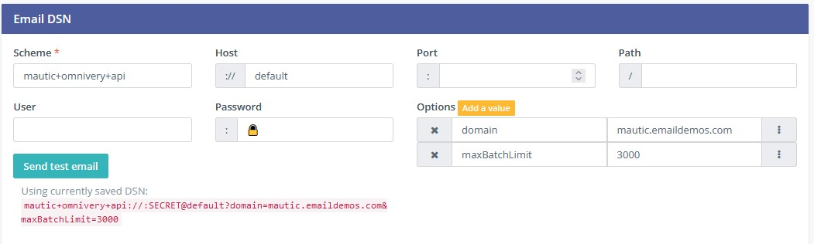

# Omnivery API plugin for Mautic v5

Plugin provides integration with Omnivery so you can send email messages from Mautic via API using your domains.

**Main Features**

- Sending emails via Omnivery API.

### Prerequisites

- Project was tested on Mautic v5.0.0-rc1.
- During development having composer setup can be handy to run scripts in `composer.json`.

### Installing

Move to plugins directory of your Mautic installation & clone repository.

```bash
cd <mautic-dir>/plugins
git clone <repo-url> OmniveryMailerBundle
cd OmniveryMailerBundle
composer install
```

Install/reload the plugin

```bash
cd <mautic-dir>
rm -rf var/cache/dev/* var/cache/prod/*
php bin/console mautic:plugins:install --env=dev  # Use mautic:plugins:reload --env=dev for update
```

## Running the tests

[work in progress]

To run all tests `composer phpunit`

To run unit tests `composer unit`

### Coding style & Syntax Check

Use commands defined by mautic core repository: [heere](https://github.com/mautic/mautic/blob/5.x/composer.json)

## Deployment

When you are reloading the plugin, make sure you use `--env=prod` switch on production.

## Documentation

- Upload the plugin to plugins folder. Name of the plugin folder needs to be `OmniveryMailerBundle`.

- Navigate to Configuration -> Email Settings -> Email DSN. Configure the settings as shown below (make sure you add your own domain and API key). API key needs to go under password field.




- Save the settings
- Send test Email to see if it works. 

**Happy emailing =)!**

## Built With

- [Mautic](https://github.com/mautic/mautic) - Marketing Automation Tool
- [Composer](https://getcomposer.org/) - Dependency Management

## Contributing

- If you have a suggestion for the feature or improvement consider opening an issue on GitHub (just make sure the same issue does not already exists).
- If you want, you can open a pull request and I will make an effort to merge it.
- Finally if this project was helpful to you **consider supporting it with a donation** via [PayPal](https://paypal.me/maticzagmajster). **Thank you!**

## Versioning

This project is using [Semantic Versioning](https://semver.org/).

## Authors

This project was adapated & is maintained by [Matic Zagmajster](http://maticzagmajster.ddns.net/). For more information please see `AUTHORS` file.

## License

This project is licensed under the GPL-3.0 License see the `LICENSE` file for details.

